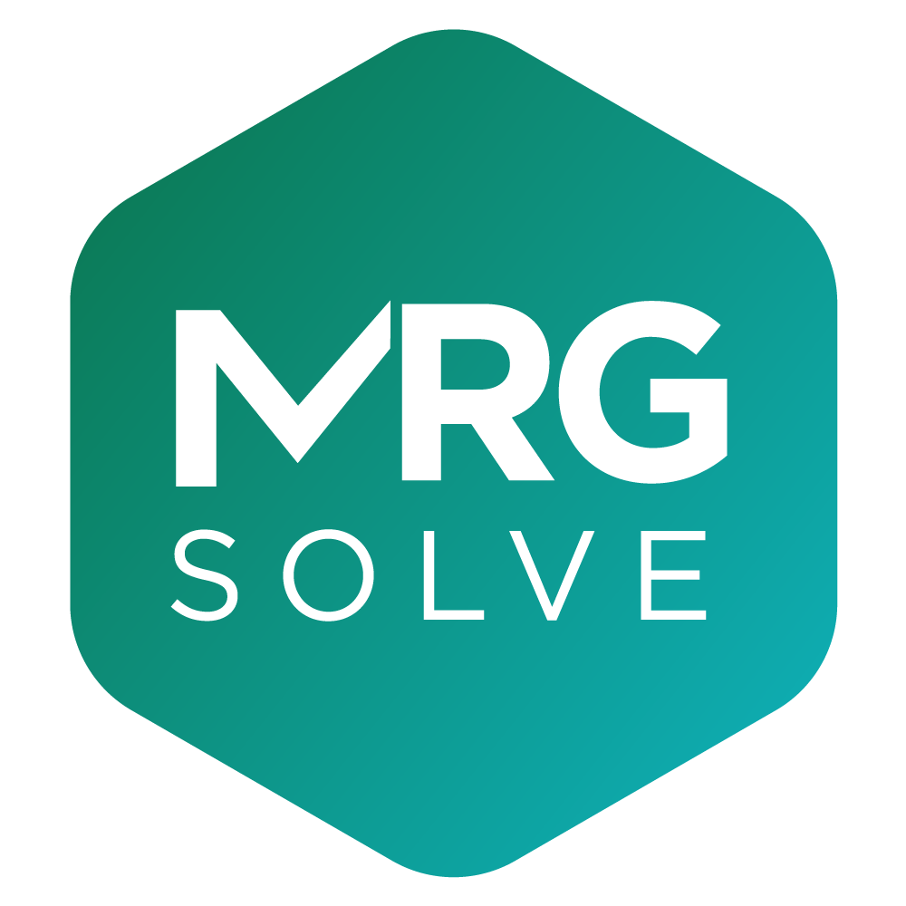

<style type="text/css">
.title {
  display: none;
}

#getting-started img {
  margin-right: 10px;
}

</style>

<div class="row" style="padding-top: 30px; width: 90%">
<!--div class="col-sm-6"-->


# **<font class=mrgg>Learn</font> mrgsolve** </img>

```{r,echo=FALSE,message=FALSE}
knitr::opts_chunk$set(cache=TRUE,autodep=TRUE,message=FALSE,fig.align="center")
source("ref.R")
```
<BR>
 
## Course and tutorial repositories

- Introduction to mrgsolve
    - Presented at the University of Minnesota Pharmacometrics Summer School, July 2019
    - URL: https://github.com/kylebaron/mpss-mrgsolve
- Integrating the R Package mrgsolve With Available Optimization Routines for 
  Parameter Estimation With PK, PK-PD and QSP Models
    - Present at the University at Buffalo CDSE Days, April 2019
    - URL: https://github.com/metrumresearchgroup/ub-cdse-2019
- Introduction to mrgsolve
    - Presented at PAGE in June, 2018
    - URL: https://github.com/metrumresearchgroup/page-2018-mrgsolve
- Case studies with mrgsolve: PBPK and QSP model implementation and utilization in R
    - Presented at University at Buffalo CDSE Days, April 2018
    - Presented at University of Florida, April 2017
    - URL: https://github.com/metrumresearchgroup/pbpk-qsp-mrgsolve
- Model Visualization Tutorial
    - Presented in Washington, DC March 2017 
    - URL: https://github.com/metrumresearchgroup/model-vis-tutorial
- R as a single‐step platform for PK/PD and PBPK/QSP M&S: integration of model estimation, 
optimization, simulation, and reporting
    - Presented at ACoP 8 2017
    - URL: https://github.com/metrumresearchgroup/lvl2-workshop


<hr></hr>


## YouTube

- Introduction to mrgsolve [playlist](https://www.youtube.com/playlist?list=PL2rG4OGekWghA8kAiWpPnwX9cjo8xxbtB)
- PBPK and QSP model implementation and utilization in R [part 1](https://youtu.be/IPwUb-ssdVA) and [part 2](https://youtu.be/sUD6ZZVzi4c)
- Introduction to mrgsolve [video](https://youtu.be/ts3Lj3hVyiw) from 2016 ISoP Study Group


</div>

